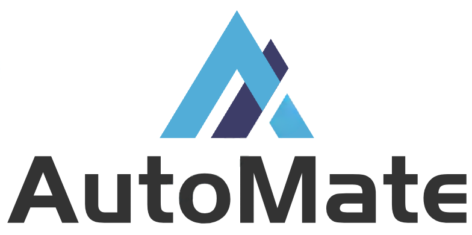
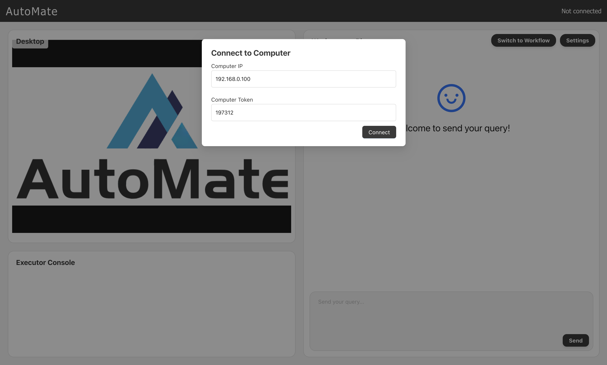
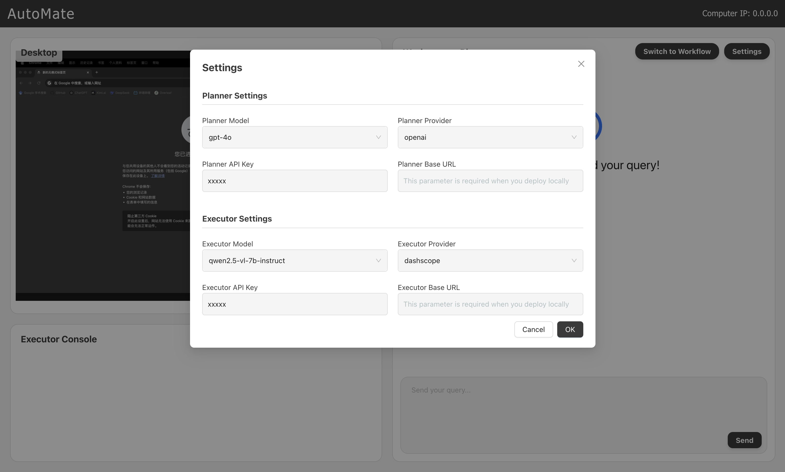

<p align="center">
    
</p>

## 💡 Overview

**AutoMate-Client** is the visual interface of the client side in **AutoMate**. This project is based on React implementation. Both the client and server of the system will be deployed locally on your device, you will connect through the local LAN, and you can also choose to deploy the local model to obtain better security. Don't worry about privacy leaks.

Welcome to learn more information in [AutoMate](https://github.com/GML-FMGroup/AutoMate). 🖥️

## 🎥 Demo


https://github.com/user-attachments/assets/2effe15b-e164-46d3-a779-df391514a182

https://github.com/user-attachments/assets/9e094395-ba0e-4b6f-8d70-059b26a3c9e8

## 👨‍💻 Quickstart

### Install Dependencies 
```bash
npm install
```

### Start the Client
```bash
npm run dev
```

### Start the Server
You need to start the project correctly according to AutoMate's project instructions, and you will see the output of the computer IP and computer token in the console.
```bash
Generated token: 197312
Chat WebSocket: ws://192.168.0.100:8000/chat
Screenshots WebSocket: ws://192.168.0.100:8001/screenshots
```

### Connect the Computer
Fill in the computer ip and computer token in the server. After the connection is successful, you will see the desktop of the computer being charged in Desktop in the upper left corner.
<p align="center">
    
</p>

### How to use ？
1. You need to click the Settings button in the upper right corner to configure relevant information. You can choose to use the vendor's API or local deployment model. If your vendor is not in the list, you can select local and fill in the vendor's base url. If you deploy locally, you also need to fill in the base url. 
<p align="center">
    
</p>
(Optional: When you only use Workflow mode, you can not fill in Planner Settings.)

2. Select the mode you need: **Planner** or **Workflow**. After sending the message, you can see the action commands made by the model in the lower left corner, and you can also see the real-time screen of the computer through the upper left corner.

3. You can learn about the progress of the task based on the color changes of Timeline.

4. If you want to learn more about the server, please go to AutoMate.
