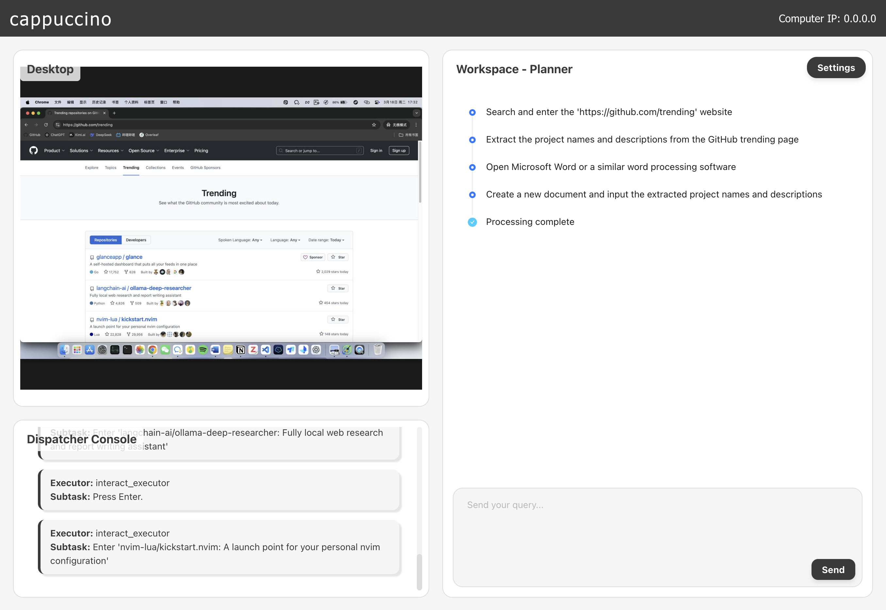
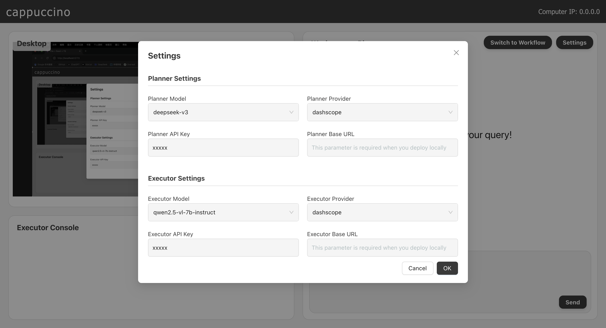

<div align="center">
<h1><span style="font-size: 60px;">☕️</span> 卡布奇诺</h1>
<p>一个解放你双手的本地自动化智能体 🤖</p>
<p>放心将任务交予我，去静享一杯醇香的卡布奇诺 ☕️</p>
<p>待你悠然归来，任务早已悄然完成 🍃</p>
</div>

## 💡 概述

**Cappuccino-client** 是 GUI Agent **卡布奇诺** 的可视化客户端。该项目基于React实现，系统的客户端和服务器都将部署在您的本地设备上，您将通过本地局域网连接，无需担心隐私泄露问题。

欢迎在 [cappuccino](https://github.com/GML-FMGroup/cappuccino) 了解更多 GUI Agent 的信息。

## 🎥 演示

https://github.com/user-attachments/assets/c3f7d0cc-a3c2-4ea3-956e-738bb1edda10

## 👨‍💻 快速开始

### 安装依赖
```bash
npm install
```

### 启动客户端
```bash
npm run dev
```

### 启动服务器
您需要按照cappuccino项目的说明正确启动项目，您将在控制台中看到计算机IP和计算机令牌的输出。例子如下：
```bash
Generated token: 197312
Chat WebSocket: ws://192.168.0.100:8000/chat
Screenshots WebSocket: ws://192.168.0.100:8001/screenshots
```

### 连接计算机
在弹窗中填写计算机IP和计算机令牌。连接成功后，您将在左上角的桌面看到被控制的计算机桌面。
<p align="center">
    
</p>

### 如何使用？
1. 您需要点击右上角的设置按钮配置相关信息。您可以选择使用供应商的 API 或本地部署模型。如果您的供应商不在列表中，您可以选择 local 并填写供应商的 Base URL。如果您进行本地部署，您需要填写 Base URL。
<p align="center">
    
</p>

2. 发送消息后，您可以根据时间线的颜色变化了解任务的进展，在左下角看到模型做出的具体操作命令，您还可以通过左上角看到计算机的屏幕实况。

3. 如果您想了解更多关于服务端的信息，请前往cappuccino。
